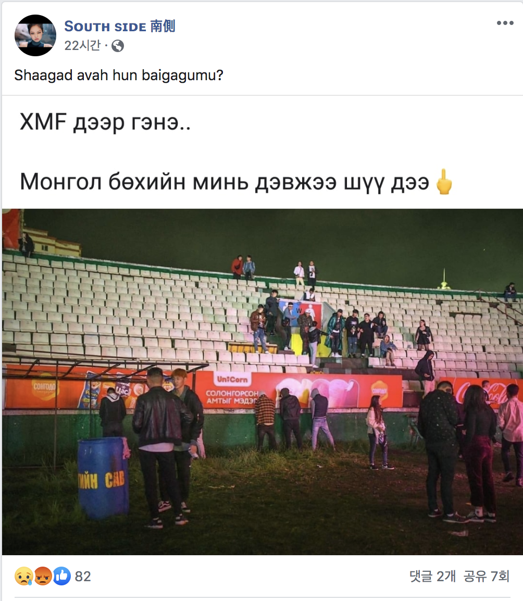

# mongolish.js

[](https://www.npmjs.com/package/mongolish)

[](https://www.npmjs.com/package/mongolish)

## Build

```bash
$ npm i

$ npm run build
```

## Usage

```html
<script src="https://unpkg.com/mongolish@1.0.0/bin/mongolish.js"></script>
```

```js
Mongolish.conversion('Solongos') 
// солонгос

Mongolish.conversion('Solongos baraa') 
// солонгос бараа

Mongolish.conversion('sain baina uu?') 
// сайн байна уу?

Mongolish.conversion('Odoo Engej chadhuu?') 
// одоо энгэж чадhуу?

Mongolish.conversion('Olon hun iluu baraa baival oruulaach gesen baina') 
// олон hун йлуу бараа байвал оруулаач гэсэн байна
```

### problem of not resolving through geogle translation can solve.



<br />


<br />


<br />


## License

[MIT](LICENSE)